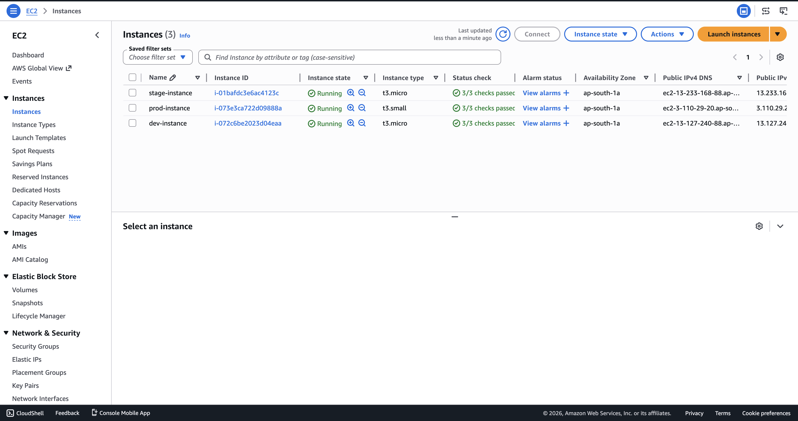
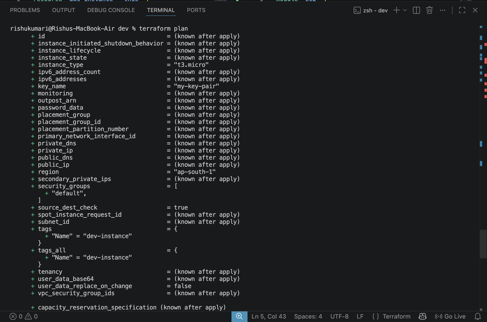
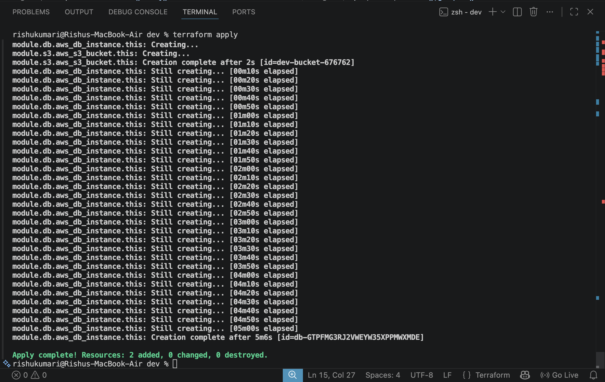
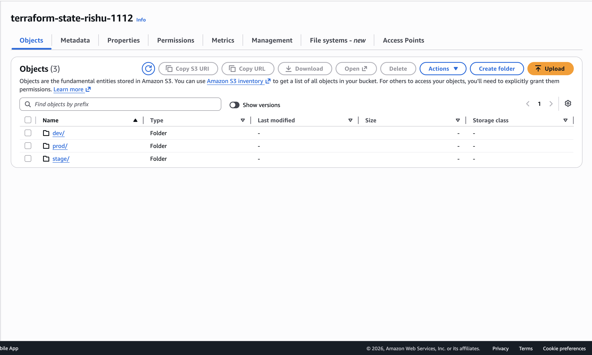
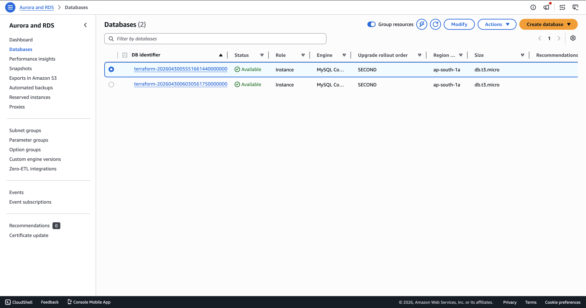
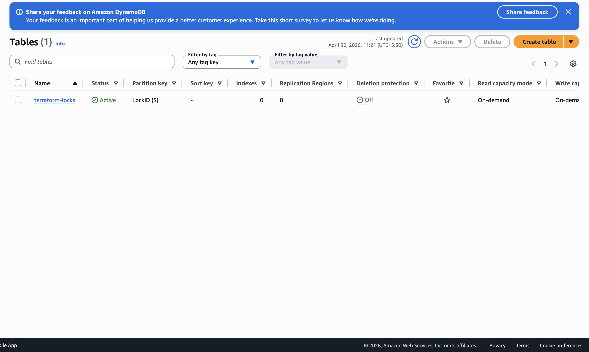
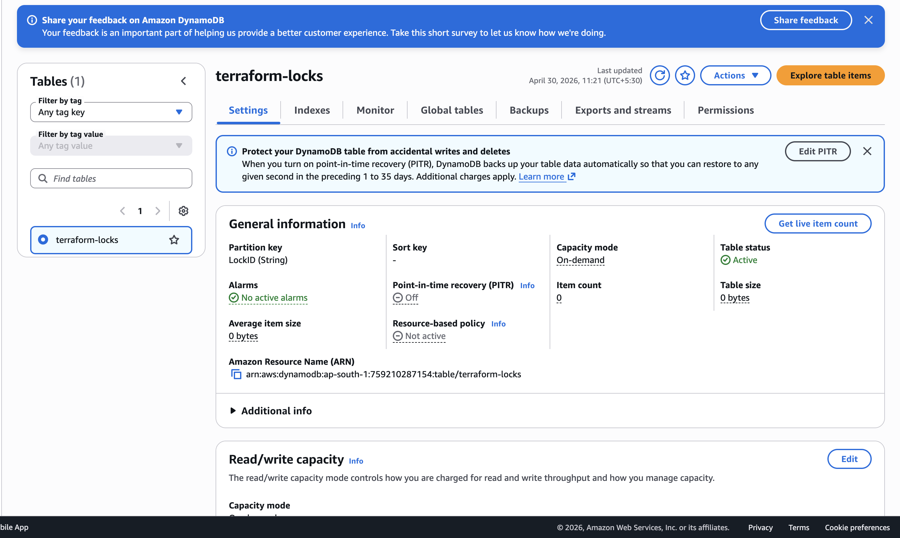
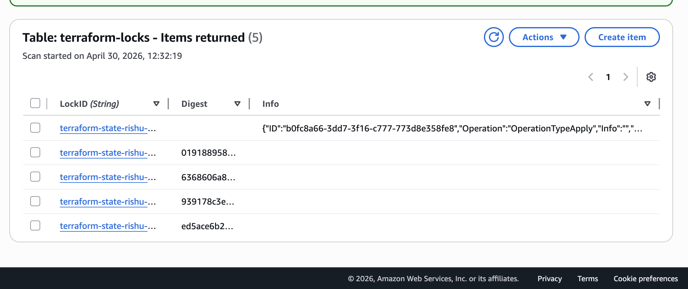
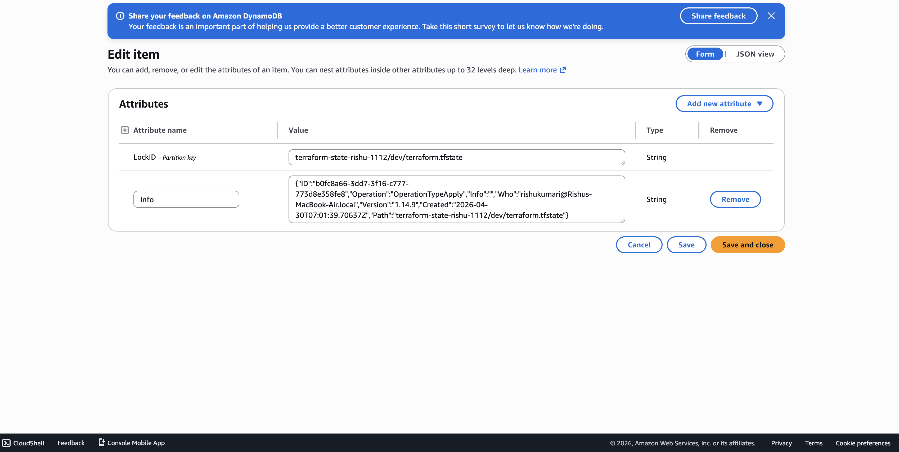
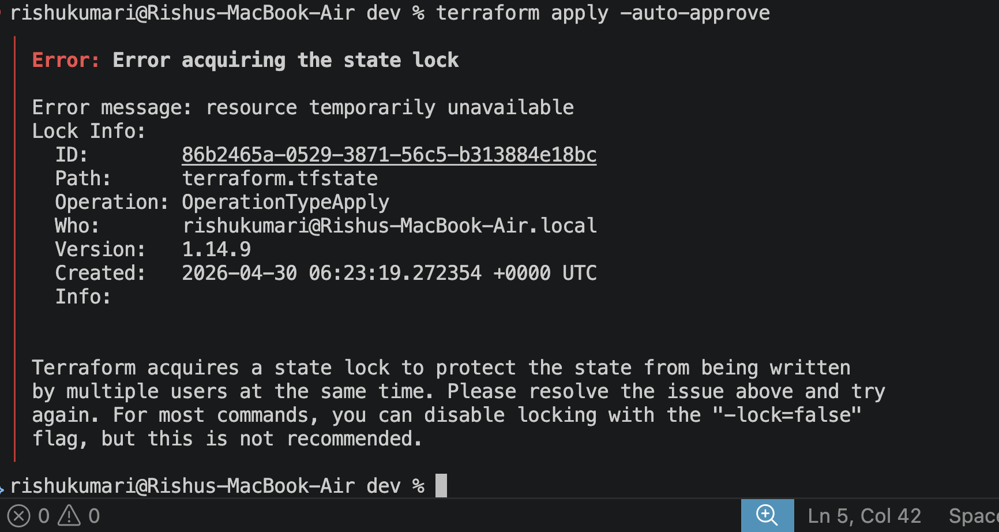

# 🚀 Terraform Multi-Environment Infrastructure on AWS

[](https://www.terraform.io/)
[](https://aws.amazon.com/)
[]

## 📌 Project Overview

This Terraform repository provisions AWS infrastructure across multiple environments using reusable modules, S3 remote state, and DynamoDB state locking. It is built for clean separation of development, staging, and production patterns.

## ⚙️ Features Implemented

- ✅ Multi-Environment Setup
  - `dev` → `t3.micro`
  - `stage` → `t3.micro`
  - `prod` → `t3.small`
- ✅ Reusable Modules
  - `modules/ec2`
  - `modules/s3`
  - `modules/db`
- ✅ Remote State Management (S3)
  - centralized Terraform state stored in S3
  - separate keys for each environment
- ✅ State Locking (DynamoDB)
  - prevents concurrent Terraform execution
  - ensures team consistency and safe state updates

> This project enables scalability, maintainability, and clean IaC code management.

## 🏗️ Architecture

The repository uses a modular architecture with separate environment layers:

- `providers.tf` — AWS provider configuration
- `modules/` — reusable Terraform modules for AWS resources
- `environments/` — environment-specific configuration and backend settings
- `screenshots/` — captured deployment and state visuals

### Components

- EC2: Instance creation via `modules/ec2`
- S3: Bucket creation via `modules/s3`
- RDS: MySQL instance via `modules/db`
- Remote state: AWS S3
- Locking: AWS DynamoDB table

## 📁 Folder Structure

```text
PROJECT-8/
├── providers.tf
├── README.md
├── .gitignore
├── modules/
│   ├── ec2/
│   │   ├── main.tf
│   │   └── variables.tf
│   ├── s3/
│   │   ├── main.tf
│   │   └── variables.tf
│   └── db/
│       ├── main.tf
│       └── variables.tf
├── environments/
│   ├── dev/
│   │   ├── backend.tf
│   │   └── main.tf
│   ├── stage/
│   │   ├── backend.tf
│   │   └── main.tf
│   └── prod/
│       ├── backend.tf
│       └── main.tf
└── screenshots/
    ├── all-env-ec2-running.png
    ├── dev-env-apply-success.png
    ├── dev-env-plan-phase.png
    ├── lock-table-conf-dash.png
    ├── rds-dash.png
    ├── s3-stage.png
    ├── terraform-active-lock.png
    ├── terraform-lock-table.png
    └── ...
```

## 🌐 Environments

Each environment is configured independently:

- `dev/` — `dev-instance`, `dev-bucket-676762`, `t3.micro`
- `stage/` — `stage-instance`, `stage-bucket-947379974`, `t3.micro`
- `prod/` — `prod-instance`, `prod-bucket-804973`, `t3.small`

> Note: the `prod` environment currently has the `db` module commented out for validation and safety.

## 🔁 Remote State Management (S3)

This project stores Terraform state in S3 using environment-specific keys:

- `dev/terraform.tfstate`
- `stage/terraform.tfstate`
- `prod/terraform.tfstate`

### Backend configuration example

```hcl
terraform {
  backend "s3" {
    bucket         = "terraform-state-rishu-1112"
    key            = "dev/terraform.tfstate"
    region         = "ap-south-1"
    dynamodb_table = "terraform-locks"
  }
}
```

## 🔒 State Locking (DynamoDB)

State locking ensures one Terraform execution runs at a time. This prevents corrupted state and race conditions.

If a stale lock appears, use:

```bash
terraform force-unlock <LOCK_ID>
```

## 🚀 How to Run

Execute commands from the chosen environment directory:

```bash
cd environments/dev
terraform init
terraform validate
terraform plan
terraform apply
```

For cleanup:

```bash
terraform destroy
```

## 📊 Real Infrastructure Created

- EC2 instances for each environment
- AWS S3 buckets for storage/state support
- AWS RDS MySQL instances
- DynamoDB lock table for safe state operations

## ⚠️ Challenges Faced & Solutions

- 🔸 Backend misconfiguration
  - Issue: backend defined inside a module
  - Fix: moved backend configuration to environment root module
- 🔸 State lock error
  - Issue: error acquiring the state lock
  - Fix: used `terraform force-unlock <LOCK_ID>` to clear stale locks
- 🔸 S3 bucket region error
  - Issue: `IllegalLocationConstraintException`
  - Fix: ensure correct S3 region and backend configuration when creating buckets

## 🔒 Sensitive Files and .gitignore

This repository ignores common Terraform, state, and secrets files:

- `*.tfstate`, `*.tfstate.backup`
- `*.tfvars`, `*.tfvars.json`
- `.terraform/`
- `.terraform.lock.hcl`
- `*.pem`, `*.key`, `*.crt`, `*.csr`
- `.DS_Store`, `.vscode/`, `.idea/`

## 📷 Screenshots

### EC2-RUNNING 🔷


### DEV-ENV-PLAN-PHASE 🔷


### DEV-ENV-APPLY-PHASE 🔷


### S3 🔷


### RDS 🔷


### DYNAMODB LOCK TABLE🔷


### LOCK TABLE CONF 🔷


### LOCK TABLE ELEMENTS 🔷


### ACTIVE LOCK 🔷


### STAGE LOCK SHOWN IN TERMINAL 🔷


## 💡 Notes

- AWS region is `ap-south-1`
- Backend state is centralized in S3 with DynamoDB locking
- Designed for modular Terraform deployments and environment separation

---
